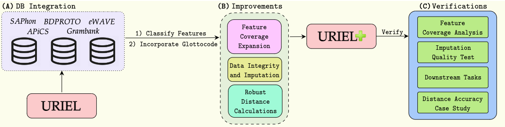

# [URIEL+: Enhancing Linguistic Inclusion and Usability in a Typological and Multilingual Knowledge Base](https://aclanthology.org/2025.coling-main.463/)



URIEL is a knowledge base offering geographical, phylogenetic, and typological vector representations for 7970 languages. It includes distance measures between these vectors for 4005 languages, which are accessible via the lang2vec tool. Despite being frequently cited, URIEL is limited in terms of linguistic inclusion and overall usability. To tackle these challenges, we introduce URIEL+, an enhanced version of URIEL and lang2vec addressing these limitations. In addition to expanding typological feature coverage for 2898 languages, URIEL+ improves user experience with robust, customizable distance calculations to better suit the needs of the users. These upgrades also offer competitive performance on downstream tasks and provide distances that better align with linguistic distance studies.

If you are interested for more information, check out our [full paper](https://aclanthology.org/2025.coling-main.463/).

## Citation

<u>If you use this code for your research, please cite the following work:</u>

```bibtex
@inproceedings{khan-etal-2025-uriel,
    title = "{URIEL}+: Enhancing Linguistic Inclusion and Usability in a Typological and Multilingual Knowledge Base",
    author = {Khan, Aditya  and
      Shipton, Mason  and
      Anugraha, David  and
      Duan, Kaiyao  and
      Hoang, Phuong H.  and
      Khiu, Eric  and
      Do{\u{g}}ru{\"o}z, A. Seza  and
      Lee, En-Shiun Annie},
    editor = "Rambow, Owen  and
      Wanner, Leo  and
      Apidianaki, Marianna  and
      Al-Khalifa, Hend  and
      Eugenio, Barbara Di  and
      Schockaert, Steven",
    booktitle = "Proceedings of the 31st International Conference on Computational Linguistics",
    month = jan,
    year = "2025",
    address = "Abu Dhabi, UAE",
    publisher = "Association for Computational Linguistics",
    url = "https://aclanthology.org/2025.coling-main.463/",
    pages = "6937--6952",
    abstract = "URIEL is a knowledge base offering geographical, phylogenetic, and typological vector representations for 7970 languages. It includes distance measures between these vectors for 4005 languages, which are accessible via the lang2vec tool. Despite being frequently cited, URIEL is limited in terms of linguistic inclusion and overall usability. To tackle these challenges, we introduce URIEL+, an enhanced version of URIEL and lang2vec that addresses these limitations. In addition to expanding typological feature coverage for 2898 languages, URIEL+ improves the user experience with robust, customizable distance calculations to better suit the needs of users. These upgrades also offer competitive performance on downstream tasks and provide distances that better align with linguistic distance studies."
}
```

<u>URIEL+ integrates data from several existing linguistic databases. If you use features derived from these sources, please also cite the corresponding original database(s), as applicable:</u>

```bibtex
@inproceedings{littell-etal-2017-uriel,
    title = "{URIEL} and lang2vec: Representing languages as typological, geographical, and phylogenetic vectors",
    author = "Littell, Patrick  and
      Mortensen, David R.  and
      Lin, Ke  and
      Kairis, Katherine  and
      Turner, Carlisle  and
      Levin, Lori",
    editor = "Lapata, Mirella  and
      Blunsom, Phil  and
      Koller, Alexander",
    booktitle = "Proceedings of the 15th Conference of the {E}uropean Chapter of the Association for Computational Linguistics: Volume 2, Short Papers",
    month = apr,
    year = "2017",
    address = "Valencia, Spain",
    publisher = "Association for Computational Linguistics",
    url = "https://aclanthology.org/E17-2002/",
    pages = "8--14"
}

@misc{michaelis-etal-2013-apics,
    editor = {Michaelis, Susanne Maria and
      Maurer, Philippe and
      Haspelmath, Martin and
      Huber, Magnus},
    title = {Atlas of Pidgin and Creole Language Structures Online},
    year = {2013},
    address = {Leipzig},
    publisher = {Max Planck Institute for Evolutionary Anthropology},
    url = {https://apics-online.info}
}

@inproceedings{marsico-etal-2018-bdproto,
    title = "{BDPROTO}: A Database of Phonological Inventories from Ancient and Reconstructed Languages",
    author = "Marsico, Egidio  and
      Flavier, Sebastien  and
      Verkerk, Annemarie  and
      Moran, Steven",
    booktitle = "Proceedings of the Eleventh International Conference on Language Resources and Evaluation ({LREC} 2018)",
    month = may,
    year = "2018",
    address = "Miyazaki, Japan",
    publisher = "European Language Resources Association (ELRA)",
    pages = "1654--1658",
    url = "http://www.lrec-conf.org/proceedings/lrec2018/pdf/534.pdf"
}

@misc{kortmann-etal-2020-ewave,
    author = {Kortmann, Bernd and
      Lunkenheimer, Kerstin and
      Ehret, Katharina},
    title = {The Electronic World Atlas of Varieties of English},
    year = {2020},
    publisher = {Zenodo},
    version = {v3.0.3},
    note = {Dataset},
    doi = {10.5281/zenodo.21789749},
    url = {https://doi.org/10.5281/zenodo.21789749}
}

@misc{michael-etal-2015-saphon,
    author = {Michael, Lev and
      Stark, Tammy and
      Clem, Emily and
      Chang, Will},
    title = {South American Phonological Inventory Database v2.1.0},
    year = {2015},
    publisher = {University of California},
    address = {Berkeley},
    note = {Survey of California and Other Indian Languages Digital Resource. Compilers: Lev Michael, Tammy Stark, Emily Clem, and Will Chang},
    url = {https://linguistics.berkeley.edu/saphon/en/}
}

@article{skirgardGrambankRevealsImportance2023,
  title = {Grambank reveals the importance of genealogical constraints on linguistic diversity and highlights the impact of language loss},
  author = {Skirgård, Hedvig and Haynie, Hannah J. and Blasi, Damián E. and Hammarström, Harald and Collins, Jeremy and Latarche, Jay J. and Lesage, Jakob and Weber, Tobias and Witzlack-Makarevich, Alena and Passmore, Sam and Chira, Angela and Maurits, Luke and Dinnage, Russell and Dunn, Michael and Reesink, Ger and Singer, Ruth and Bowern, Claire and Epps, Patience and Hill, Jane and Vesakoski, Outi and Robbeets, Martine and Abbas, Noor Karolin and Auer, Daniel and Bakker, Nancy A. and Barbos, Giulia and Borges, Robert D. and Danielsen, Swintha and Dorenbusch, Luise and Dorn, Ella and Elliott, John and Falcone, Giada and Fischer, Jana and Ghanggo Ate, Yustinus and Gibson, Hannah and Göbel, Hans-Philipp and Goodall, Jemima A. and Gruner, Victoria and Harvey, Andrew and Hayes, Rebekah and Heer, Leonard and Herrera Miranda, Roberto E. and Hübler, Nataliia and Huntington-Rainey, Biu and Ivani, Jessica K. and Johns, Marilen and Just, Erika and Kashima, Eri and Kipf, Carolina and Klingenberg, Janina V. and König, Nikita and Koti, Aikaterina and Kowalik, Richard G. A. and Krasnoukhova, Olga and Lindvall, Nora L.M. and Lorenzen, Mandy and Lutzenberger, Hannah and Martins, Tônia R.A. and Mata German, Celia and family=Meer, given=Suzanne, prefix=van der, useprefix=true and Montoya Samamé, Jaime and Müller, Michael and Muradoglu, Saliha and Neely, Kelsey and Nickel, Johanna and Norvik, Miina and Oluoch, Cheryl Akinyi and Peacock, Jesse and Pearey, India O.C. and Peck, Naomi and Petit, Stephanie and Pieper, Sören and Poblete, Mariana and Prestipino, Daniel and Raabe, Linda and Raja, Amna and Reimringer, Janis and Rey, Sydney C. and Rizaew, Julia and Ruppert, Eloisa and Salmon, Kim K. and Sammet, Jill and Schembri, Rhiannon and Schlabbach, Lars and Schmidt, Frederick W.P. and Skilton, Amalia and Smith, Wikaliler Daniel and family=Sousa, given=Hilário, prefix=de, useprefix=true and Sverredal, Kristin and Valle, Daniel and Vera, Javier and Voß, Judith and Witte, Tim and Wu, Henry and Yam, Stephanie and Ye 葉婧婷, Jingting and Yong, Maisie and Yuditha, Tessa and Zariquiey, Roberto and Forkel, Robert and Evans, Nicholas and Levinson, Stephen C. and Haspelmath, Martin and Greenhill, Simon J. and Atkinson, Quentin D. and Gray, Russell D.},
  journal = {Science Advances},
  volume = {9},
  number = {16},
  doi = {10.1126/sciadv.adg6175},
  year = {2023}
}
```

If you have any questions, you can open a [GitHub Issue](https://github.com/Lee-Language-Lab/URIELPlus/issues) or send us an [email](mailto:masonshipton25@gmail.com).

Contributors: [Aditya Khan](mailto:adityakhan@cs.toronto.edu), [Mason Shipton](mailto:masonshipton25@gmail.com), [York Hay Ng](mailto:york.ng@mail.utoronto.ca), [David Anugraha](mailto:anugraha@cs.toronto.edu), [Kaiyao Duan](mailto:davidduan04@gmail.com), [Phuong H. Hoang](mailto:fiona.hoang@mail.utoronto.ca), [Eric Khiu](mailto:erickhiu@umich.edu), [Xiang Lu](mailto:jameslx@umich.edu), [A. Seza Doğruöz](mailto:as.dogruoz@ugent.be), [En-Shiun Annie Lee](mailto:annie.lee@ontariotechu.ca)

## Contents

+ [Environment](#environment)
+ [Setup Instruction](#setup-instruction)
+ [Configuration Options Examples](#configuration-options-examples)
+ [Retrieving Loaded Features Examples](#retrieving-loaded-features-examples)
+ [Database Integration Examples](#database-integration-examples)
+ [Language Codes Examples](#language-codes-examples)
+ [Imputation Examples](#imputation-examples)
+ [Language Distance Calculation Examples](#language-distance-calculation-examples)

## Environment

The core package is tested on Python 3.10, 3.11, and 3.12. It does not require TensorFlow, TensorFlow Addons, MIDASpy, or the optional imputation libraries.

## Setup Instruction

+ To get started with URIEL+:
    ```bash
    pip install urielplus
    ```

    ```python
    from urielplus import urielplus

    u = urielplus.URIELPlus()
    ```

+ Optional KNN, mean, and SoftImpute dependencies:
    ```bash
    pip install "urielplus[imputation]"
    ```

+ MIDASpy is isolated to a Python 3.10 environment:
    ```bash
    pip install "urielplus[midaspy]"
    ```

## Configuration Options Examples

+ URIEL+ offers various configurations that you can adjust:
    - Caching: Enable or disable caching (True or False).
    - Aggregation Method: Choose the method for aggregating data across sources ('U' for unweighted, 'A' for weighted).
    - Fill Missing Data: Decide whether to fill missing data using parent language data (True or False).
    - Distance Metric: Specify the distance metric to be used ("angular" or "cosine").
    - Include Lineage In Eval: Decide whether values filled in via parent language (lineage) data during imputation are included when evaluating imputation quality (True or False).
    - Restrict eWAVE To Own Languages: Decide whether eWAVE-exclusive features are restricted to eWAVE's own languages (plus `"stan1293"`) (True or False).

+ Changing A Configuration:
    ```python
    u.set_{configuration}({option})
    ```

+ Checking A Configuration:
    ```python
    u.get_{configuration}()
    ```

+ Replace `{configuration}` with `cache`, `aggregation`, `fill_with_base_lang`, `distance_metric`, `include_lineage_in_eval`, or `restrict_ewave_to_own_languages`.
+ Replace `{option}` with your desired value for the selected configuration.
+ Note: the default configurations are `cache=False`, `aggregation='U'`, `fill_with_base_lang=True`, `distance_metric="angular"`, `include_lineage_in_eval=False`, and `restrict_ewave_to_own_languages=True`.
+ NOTE: Setting `restrict_ewave_to_own_languages` to `True` immediately and irreversibly forces eWAVE-exclusive feature values for languages outside eWAVE's scope to -1 (missing) the next time that data is accessed or computed on. Setting it back to `False` afterward does not restore those values, unless URIEL+ is reset.

## Retrieving Loaded Features Examples

+ Retrieving A Loaded Feature:
    ```python
    u.get_{vector_type}_{feature_type}_array()
    ```
+ Replace `{vector_type}` with `phylogeny`, `typological`, `geography`, or `script`.
+ Replace `{feature_type}` with `features`, `languages`, `data`, or `sources`.

+ Example:
    ```python
    u.get_typological_languages_array()
    ```

## Database Integration Examples

+ NOTE: `integrate_databases()` integrates **all** available databases, including eWAVE and APiCS, which you may not want. eWAVE adds hundreds of features that only apply to English dialects, and APiCS adds hundreds of features but has data for only 76 languages. Both can add substantial sparsity and features you may not need. To exclude them, integrate only the databases you want, either individually or in one call (see "Integrating Only Some Databases" below).

+ Integrating All Databases:
    ```python
    u.integrate_databases()
    ```
+ Integrating One Database:
    ```python
    u.integrate_{database}()
    ```
+ Integrating Only Some Databases (Excluding Others):
    ```python
    u.integrate_custom_databases({databases})
    ```

+ Example: Integrating Every Database Except eWAVE and APiCS
    ```python
    # Option 1: one call
    u.integrate_custom_databases("UPDATED_SAPHON", "BDPROTO", "GRAMBANK", "GLOTTOLOG")

    # Option 2: one database at a time
    u.integrate_saphon()
    u.integrate_bdproto()
    u.integrate_grambank()
    u.integrate_glottolog()
    ```

+ Set Language Codes to Glottocodes:
    ```python
    u.set_glottocodes()
    ```

+ Reset all changes:
    ```python
    u.reset()
    ```

+ NOTE: `reset()` only resets URIEL+'s in-memory attributes back to their initial state. It does not change or delete any files that were already written to disk when caching was enabled. If you want those cached files reset as well, you will need to remove or replace them manually.

+ Replace `{database}` with `saphon`, `bdproto`, `grambank`, `apics`, `ewave`, or `glottolog`.
+ Replace `{databases}` with arguments `"UPDATED_SAPHON"`, `"BDPROTO"`, `"GRAMBANK"`, `"APICS"`, `"EWAVE"`, and/or `"GLOTTOLOG"` (e.g., `"UPDATED_SAPHON"`, `"BDPROTO"`, `"EWAVE"`).

## Language Codes Examples

+ Checking How Languages Are Currently Identified:
    ```python
    u.get_codes()
    ```
+ Returns `"Iso"` if languages are identified with ISO 639-3 codes, or `"Glotto"` if identified with Glottocodes. Defaults to `"Iso"`.

+ Checking If A Code Is An ISO 639-3 Code:
    ```python
    u.is_iso_code({language})
    ```

+ Checking If A Code Is A Glottocode:
    ```python
    u.is_glottocode({language})
    ```

+ Retrieving Dialects:
    ```python
    u.get_dialects()
    ```
+ Returns a dictionary mapping the index of each base language in URIEL+'s typological languages array to a list of its dialect language codes. Works with either ISO 639-3 codes or Glottocodes, based on the current setting from `get_codes()`.

+ Replace `{language}` with a language code (e.g., `"stan1293"`, `"eng"`).

## Imputation Examples

+ Aggregate Typological and Script Data:
    ```python
    u.set_aggregation({aggregation}) 
    u.aggregate()
    ```

+ Impute Missing Values:
    ```python
    u.{imputation_strategy}_imputation()
    ```

+ Replace `{aggregation}` with `'U'` (union) or `'A'` (average).
+ Replace `{imputation_strategy}` with `midaspy`, `knn`, `softimpute`, or `mean`.

+ Retrieving The Languages Filled In Via Lineage-Based Imputation:
    ```python
    u.get_lineage_imputed_indices()
    ```
+ Returns the set of language indices whose values were filled in using parent language (lineage) data during the most recent imputation run. Used together with the `include_lineage_in_eval` configuration when evaluating imputation quality.

+ Manually Setting The Lineage-Imputed Indices:
    ```python
    u.set_lineage_imputed_indices({indices})
    ```
+ Replace `{indices}` with a set of language indices (e.g., `{0, 4, 7}`).

## Language Distance Calculation Examples

+ Calculate a Specific Distance:
    ```python
    print(u.new_distance({distance_type}, {languages}))
    ```

+ Calculate Distance Using Specific Features:
    ```python
    print(u.new_custom_distance({features}, {languages}, source={source}))
    ```

+ Retrieve Language Vectors:
    ```python
    u.get_vector({distance_type}, {languages})
    ```

+ View URIEL+ Feature Coverage For All Resource Levels And Distance Types:
    ```python
    u.all_feature_coverage()
    ```

+ View URIEL+ Feature Coverage For A Specific Resource Level And Distance Type:
    ```python
    u.feature_coverage({resource_level}, {distance_type})
    ```
+ Replace `{resource_level}` with `"high-resource"`, `"medium-resource"`, or `"low-resource"`.

+ Calculate Confidence Scores for Distances
    ```python
    print(u.confidence_score({language 1}, {language 2}, {distance_type}))
    ```

+ Replace `{distance_type}` with a distance type (`"genetic"`, `"syntactic"`, `"featural"`, `"phonological"`, `"inventory"`, `"geographic"`, `"morphological"`, or `"script"`) or a list of distance types (e.g., `["syntactic", "phonological"]`). Must be a single distance type for retrieving language vectors and calculating feature coverage or confidence scores.
+ Replace `{features}` with a list of current features (e.g., `["S_SUBJECT_BEFORE_VERB", "P_VOICE"]`).
+ Replace `{languages}`, `{language 1}`, and `{language 2}` with language codes (e.g., `"stan1293"`, `"hind1269"`).
+ Replace `{source}` with one database (e.g., `"WALS"`) or all databases (`'A'`).
+ Note: the default `{source}` is all databases.
