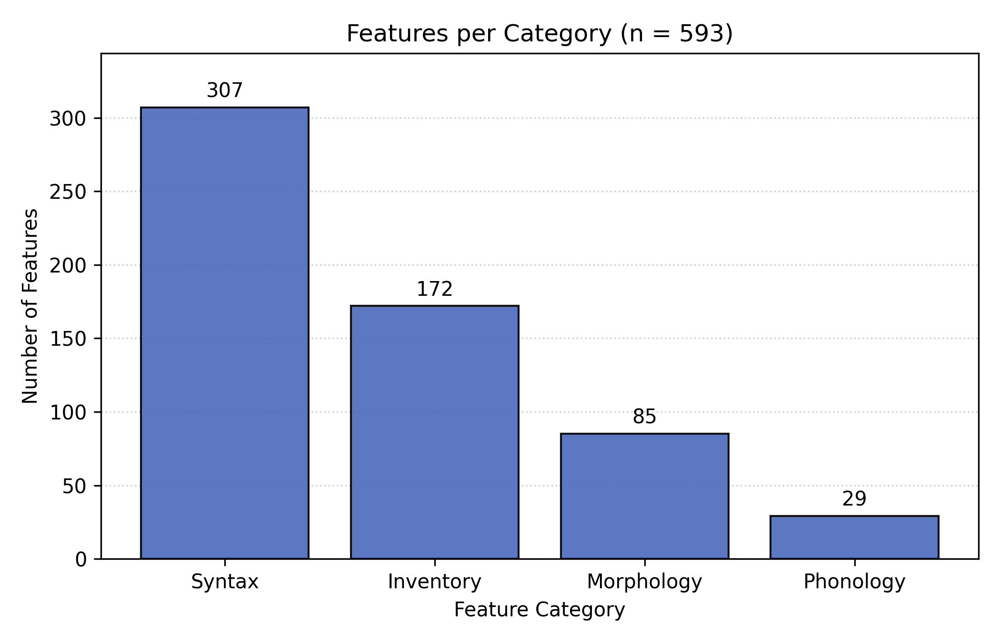

# Feature Categories in `features.npz`

## Overview

`data/features.npz` stores the URIEL+ feature matrix used in the Milestone 2 EDA.
Each feature has a name that begins with a prefix identifying the category it
belongs to:

| Prefix | Category |
|---|---|
| `S_` | Syntax |
| `M_` | Morphology |
| `INV_` | Inventory |
| `P_` | Phonology |

This section counts how many of the features fall into each category and shows
the result as a bar chart. The full code is in `feature_categories.py`.

---

## 1. Loading the File

An `.npz` file is a bundle of named arrays. As in the rest of the EDA, the data
folder is extracted from `data.zip` if it is not already there. Listing the
file's `files` attribute shows what it contains; the feature names are in the
array called `feats`.

### Script: Load and Count Features by Category

```python
import os
import zipfile
from collections import Counter

import numpy as np
import matplotlib.pyplot as plt

# Extract the data folder if needed (same setup as the EDA notebook)
if not os.path.exists('data'):
    with zipfile.ZipFile('data.zip', 'r') as z:
        z.extractall('.')

# Feature-name prefix -> category
PREFIXES = {'S_': 'Syntax', 'M_': 'Morphology', 'INV_': 'Inventory', 'P_': 'Phonology'}

# Load the file and list the arrays stored in it
npz_file = np.load('data/features.npz', allow_pickle=True)
print(f"Arrays in the NPZ file: {npz_file.files}")

features = npz_file['feats'].astype(str)
num_features = len(features)
print(f"Loaded {num_features} features.")

# Count how many features fall under each category prefix
counts = Counter()
for name in features:
    for prefix, label in PREFIXES.items():
        if name.startswith(prefix):
            counts[label] += 1
            break
    else:
        counts['Other'] += 1  # keeps any unexpected prefix visible

print(dict(counts))
print(f"Features counted: {sum(counts.values())} / {num_features}")
```

**Result:** the file contains the arrays `data`, `feats`, `langs` and `sources`.
Every feature is counted exactly once, and any name without one of the four
prefixes would show up under `Other` rather than being dropped.

All 593 feature names carry one of the four prefixes, so nothing falls under
`Other`.

| Category | Prefix | Features | Share |
|---|---|---|---|
| Syntax | `S_` | 307 | 51.8% |
| Inventory | `INV_` | 172 | 29.0% |
| Morphology | `M_` | 85 | 14.3% |
| Phonology | `P_` | 29 | 4.9% |
| **Total** | | **593** | **100%** |

---

## 2. Bar Chart

### Script: Plot the Counts

```python
labels = [label for label, _ in counts.most_common()]   # largest first
values = [counts[label] for label in labels]

fig, ax = plt.subplots(figsize=(7, 4.5))
bars = ax.bar(labels, values, color='#4a69bd', edgecolor='black', alpha=0.9)
ax.bar_label(bars, padding=3)   # print the count above each bar

ax.set_title(f'Features per Category (n = {num_features})')
ax.set_xlabel('Feature Category')
ax.set_ylabel('Number of Features')
ax.set_ylim(0, max(values) * 1.12)   # headroom so the top label is not clipped
ax.grid(axis='y', linestyle=':', alpha=0.6)
ax.set_axisbelow(True)

plt.tight_layout()
plt.savefig('fig_feature_categories.png', dpi=300)
plt.show()
```



*Figure 1. Syntax features make up about 52% of the 593 features, more than
inventory, morphology and phonology combined. Phonology is the smallest
category, with only 29 features.*

---

## 3. Summary

- `features.npz` holds 593 features, and every one is labelled with a known
  category prefix.
- Syntax dominates with 307 features (51.8%), followed by inventory (172),
  morphology (85) and phonology (29).