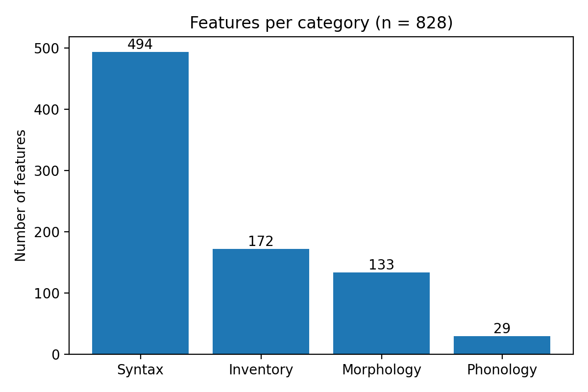

# Feature Categories in `features.npz`

## Overview

`features.npz` stores the URIEL+ feature matrix. Each of its 828 features has a
name that begins with a prefix identifying the category it belongs to:

| Prefix | Category |
|---|---|
| `S_` | Syntax |
| `M_` | Morphology |
| `INV_` | Inventory |
| `P_` | Phonology |

This document counts how many of the 828 features fall into each category and
shows the result as a bar chart.

---

## 1. Loading the File

An `.npz` file is a bundle of named arrays. Loading it and listing its
`files` attribute shows what it contains; the feature names are in the array
called `feats`.

### Script: Load and Count Features by Category

```python
import numpy as np
import matplotlib.pyplot as plt
from collections import Counter

# Load the file and list the arrays stored in it
npz_file = np.load("lang2vec/data/features.npz", allow_pickle=True)
print("Arrays in the NPZ file:", npz_file.files)

features = npz_file["feats"].astype(str)
print("Number of features:", len(features))   # -> 828

# Feature-name prefix -> category
prefixes = {"S_": "Syntax", "M_": "Morphology", "INV_": "Inventory", "P_": "Phonology"}

counts = Counter(
    label
    for name in features
    for prefix, label in prefixes.items()
    if name.startswith(prefix)
)
print(dict(counts))
print("features counted:", sum(counts.values()))   # -> 828, so none are unlabelled
```

**Result:** the file contains four arrays (`data`, `feats`, `langs`,
`sources`). All 828 feature names carry one of the four prefixes, so every
feature is counted exactly once.

| Category | Prefix | Features | Share |
|---|---|---|---|
| Syntax | `S_` | 494 | 59.7% |
| Inventory | `INV_` | 172 | 20.8% |
| Morphology | `M_` | 133 | 16.1% |
| Phonology | `P_` | 29 | 3.5% |
| **Total** | | **828** | **100%** |

---

## 2. Bar Chart

### Script: Plot the Counts

```python
labels = [label for label, _ in counts.most_common()]   # largest first
values = [counts[label] for label in labels]

fig, ax = plt.subplots(figsize=(6, 4))
bars = ax.bar(labels, values, color="tab:blue")
ax.bar_label(bars)   # print the count above each bar
ax.set_ylabel("Number of features")
ax.set_title(f"Features per category (n = {len(features)})")
plt.tight_layout()
plt.savefig("fig_feature_categories.png", dpi=200)
plt.show()
```



*Figure 1. Syntax features make up about 60% of the 828 features, more than
inventory, morphology and phonology combined. Phonology is the smallest
category, with only 29 features.*

---

## 3. Summary

- `features.npz` holds 828 features, and every one is labelled with a known
  category prefix.
- Syntax dominates with 494 features (59.7%), followed by inventory (172),
  morphology (133) and phonology (29).